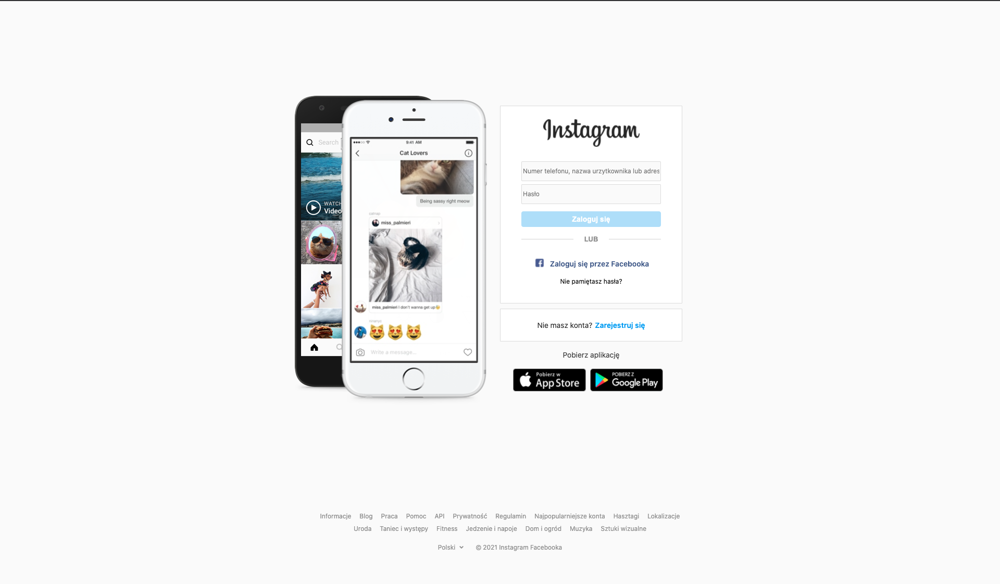

# Instagram Clone with Firebase Auth

Klon strony logowania instagram.com 1 do 1  
Responsywna i początkowo stworzona wyłącznie poprzez html i css.  
W kolejnym etapie kiedy poznałam już JavaScript dodałam możliwość rejestracji i logowania i wylogowania, korzystając z Firebase Auth.  

  
